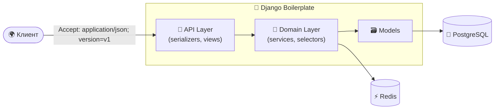

<div align="center">


[](https://git.io/typing-svg)

[](https://github.com/ak4code/django_boilerplate/actions/workflows/ci.yml)
[](https://www.python.org/)
[](https://www.djangoproject.com/)
[](https://www.django-rest-framework.org/)
[](https://www.postgresql.org/)
[](https://redis.io/)
[](https://www.docker.com/)
[](https://docs.astral.sh/uv/)
[](https://docs.astral.sh/ruff/)

</div>

---

## ✨ Возможности

| | |
| --- | --- |
| 🏗️ **API-first монолит** | Слои: views → services / selectors → models |
| 🔖 **Версионирование через заголовок** | `AcceptHeaderVersioning` — чистые URL без `/v1/` |
| 📖 **OpenAPI из коробки** | Swagger UI и ReDoc (drf-spectacular) |
| ⚙️ **12-factor конфигурация** | Всё через переменные окружения (django-environ) |
| 🔒 **Безопасный production** | HSTS, secure cookies, SSL redirect, whitenoise, gunicorn |
| ⚡ **Highload-тюнинг** | Пул соединений psycopg, кэш-сессии, Argon2, rate limiting |
| 👤 **Кастомный пользователь** | Email-логин + `external_id` (UUID) для интеграций |
| 💓 **Health-check** | `/health/` с проверкой БД и Redis — готов для k8s-проб |
| 🧹 **Качество кода** | ruff · bandit · ty · pre-commit · pytest · GitHub Actions |
| 🐳 **Docker** | Multi-stage образ (non-root, HEALTHCHECK) + compose dev/prod |

## 🚀 Быстрый старт

### 🐳 Docker (рекомендуется)

```bash
make env        # создать .env из .env.example
make up         # собрать и запустить postgres + redis + django
make logs       # смотреть логи
```

➜ Приложение: http://localhost:8000 · Swagger UI: http://localhost:8000/api/docs/

### 💻 Локально

```bash
make env
make install    # uv sync --group dev
make migrate
make run
```

> 💡 По умолчанию локально используется SQLite; для PostgreSQL задайте `DATABASE_URL` в `.env`.

## 🔖 Версионирование API

Используется `AcceptHeaderVersioning`: клиент передаёт версию в заголовке `Accept`,
URL остаются стабильными (`/api/users/...` без `/v1/`).

```bash
# ✅ Явно указанная версия
curl http://localhost:8000/api/users/me/ \
  -H 'Accept: application/json; version=v1'

# ✅ Без версии — используется DEFAULT_VERSION (v1)
curl http://localhost:8000/api/users/me/

# ❌ Неподдерживаемая версия → 406 Not Acceptable
curl http://localhost:8000/api/users/me/ \
  -H 'Accept: application/json; version=v999'
```

Версия доступна во view через `request.version`. Список поддерживаемых версий —
`ALLOWED_VERSIONS` в `config/settings/base.py`. Чтобы выпустить `v2`, добавьте версию
в `ALLOWED_VERSIONS` и ветвите логику по `request.version` (или подключайте другой
сериализатор), не меняя URL.

## 🌐 Эндпоинты

| Метод | URL | Описание |
| :---: | --- | --- |
| `POST` | `/api/users/register/` | 📝 Регистрация пользователя |
| `GET` | `/api/users/me/` | 👤 Профиль текущего пользователя |
| `GET` | `/api/schema/` | 📄 OpenAPI-схема |
| `GET` | `/api/docs/` | 📖 Swagger UI |
| `GET` | `/api/redoc/` | 📕 ReDoc |
| `GET` | `/health/` | 💓 Health-check (БД + Redis), 503 при сбое |
| — | `/admin/` | 🛠️ Django admin |

## 🏛️ Архитектура

Монолитное API-ориентированное приложение по стандартам **Twelve-Factor App**.
Бизнес-функционал инкапсулирован в изолированные приложения внутри `apps/` —
каждый модуль проектируется как независимый компонент, что облегчает будущий
вынос в микросервисы.



## 📁 Структура проекта

Структура следует лучшим практикам ([HackSoft Django Styleguide](https://github.com/HackSoftware/Django-Styleguide),
[cookiecutter-django](https://github.com/cookiecutter/cookiecutter-django)) — три корневых пакета
с чёткими зонами ответственности:

```
├── 📂 apps/                  # Бизнес-приложения (изолированные модули)
│   └── users/
│       ├── api/              # Слой API: serializers, views, urls
│       ├── services.py       # Бизнес-логика (запись)
│       ├── selectors.py      # Бизнес-логика (чтение)
│       ├── models.py
│       └── tests/
├── ⚙️ config/                # Только конфигурация проекта
│   ├── settings/             # base.py + dev.py / prod.py (split-settings)
│   ├── urls.py
│   ├── asgi.py
│   └── wsgi.py
├── 🧰 core/                  # Переиспользуемый инфраструктурный код
│   ├── health.py             # Health-check view
│   ├── integrations/         # Клиенты внешних сервисов
│   ├── mixins/               # Примеси для моделей (timestamps и т.п.)
│   └── redis/                # Redis-клиент
├── 🐳 Dockerfile             # Multi-stage, non-root
├── 🐳 docker-compose.yml     # postgres + redis + django
└── 📦 pyproject.toml         # Зависимости (uv), ruff, bandit, pytest
```

| Пакет | Ответственность | Правило |
| --- | --- | --- |
| `apps/` | Бизнес-логика | Может импортировать `core/`, но не `config/` |
| `core/` | Инфраструктура, переиспользуемый код | Не знает о бизнес-логике |
| `config/` | Настройки, маршрутизация, WSGI/ASGI | Только конфигурация, без логики |

## 🛠️ Команды

```bash
make install         # 📦 установить зависимости (с dev-группой)
make run             # 🚀 запустить dev-сервер
make migrate         # 🗃️ применить миграции
make makemigrations  # 📝 создать миграции
make superuser       # 👑 создать суперпользователя
make test            # 🧪 запустить тесты
make lint            # 🔍 ruff check + format check + bandit
make format          # ✨ автоформатирование
make up / down       # 🐳 docker compose up/down
```

## ⚙️ Конфигурация

Все настройки — через переменные окружения (см. [`.env.example`](.env.example)).

<details>
<summary><b>📋 Ключевые переменные окружения</b></summary>

<br/>

| Переменная | Назначение | По умолчанию |
| --- | --- | --- |
| `ENVIRONMENT` | `dev` или `prod` (выбор настроек) | `dev` |
| `DJANGO_SECRET_KEY` | Секретный ключ (обязателен) | — |
| `DJANGO_DEBUG` | Режим отладки | `False` (prod), `True` (dev) |
| `DJANGO_ALLOWED_HOSTS` | Разрешённые хосты через запятую | — |
| `DATABASE_URL` | URL базы данных | SQLite |
| `DJANGO_DB_POOL` | Пул соединений psycopg (PostgreSQL) | `True` |
| `DJANGO_DB_POOL_MAX_SIZE` | Максимум соединений в пуле (на процесс) | `10` |
| `REDIS_URL` | URL Redis для кэша | `redis://redis:6379/1` |
| `REDIS_MAX_CONNECTIONS` | Размер пула Redis-клиента | `100` |
| `DJANGO_THROTTLE_ANON` | Лимит запросов для анонимов | `100/min` |
| `DJANGO_THROTTLE_USER` | Лимит запросов для пользователей | `1000/min` |
| `DJANGO_NUM_PROXIES` | Прокси перед приложением (prod) | `1` |
| `DJANGO_LOG_LEVEL` | Уровень логирования | `INFO` |
| `GUNICORN_WORKERS` | Воркеры gunicorn | `CPU × 2 + 1` |
| `GUNICORN_THREADS` | Потоки на воркер (gthread) | `4` |

</details>

<details>
<summary><b>🔒 Production-развёртывание</b></summary>

<br/>

`ENVIRONMENT=prod` включает: `DEBUG=False`, SSL redirect, HSTS, secure cookies,
JSON-only рендеринг DRF, манифестную статику (whitenoise) и запуск через gunicorn.

```bash
make up-prod
# или явно:
docker compose -f docker-compose.yml -f docker-compose.prod.yml up -d --build
```

В prod-режиме код запекается в образ (таргет `production`, без bind-mount),
dev-зависимости не устанавливаются, порты PostgreSQL/Redis не публикуются,
на сервисы наложены лимиты CPU/памяти.

</details>

<details>
<summary><b>🐳 Устройство Docker-окружения</b></summary>

<br/>

**Dockerfile** (multi-stage):

| Стадия | Назначение |
| --- | --- |
| `builder` | Сборка venv через uv (`--locked`, BuildKit-кэш, прекомпиляция байткода) |
| `runtime` | Минимальный рантайм для разработки: non-root, venv принадлежит root |
| `production` | `runtime` + код, запечённый в образ |

Образ содержит `HEALTHCHECK`, который опрашивает `/health/` (БД + Redis).

**Compose** (три файла):

| Файл | Когда применяется |
| --- | --- |
| `docker-compose.yml` | Общая база: сервисы, healthchecks, лимиты логов |
| `docker-compose.override.yml` | Dev: подхватывается автоматически — bind-mount кода, порты БД на localhost |
| `docker-compose.prod.yml` | Prod: подключается явно — таргет `production`, лимиты ресурсов |

</details>

## 🧹 Качество кода

```bash
uv run pre-commit install   # включить pre-commit хуки
make lint                   # проверка
make test                   # тесты
```

CI (GitHub Actions) запускает линтеры и тесты на каждый push в `main` и pull request.

<div align="center">


</div>
